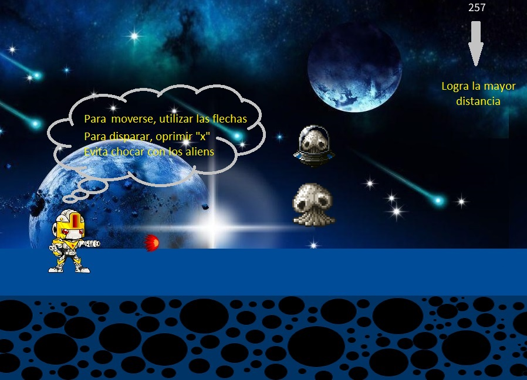

# Nombre:

# Historia

Tras la busqueda de diferentes planetas para habitar, los humanos encontraron "Gonta" un planeta muy similar a la Tierra, pero con un mayor tamaño. En una de las exploraciones del nuevo planeta, se descubrio que el planeta ya tenia habitantes, los cuales al ver el explorador se tornaron agresivos destruyendolo en poco tiempo. Al ver esto, se empezo a crear una forma para acabar con esta especie.

Así fue como se creo el prototipo CH4RL13 "Charly" un robot con la función primaria de acabar con esa especie, para esto se le instalo un cañon en el brazo. Apenas llego a la superfie de Gonta los habitantes se dispusieron a destruirlo, Charly les va a dar pelea.

Charly va a necesitar ayuda para acabar con todos los habitantes de Gonta.

# Descripción

Es un programa de un solo jugador de tipo aventura, el programa le permite al usuario manejar a Charly para moverlo o hacer que este dispare. El usuario puede elejir si desea o no escuchar la música de fondo, así como moverse por el menú del juego.

# Requisitos

-El usuario debe tener Processing para poder ejecutar el programa.

-Para poder escuchar la música de fondo, el usuario debe tener instalada la libreria "Sound" que perimite reproducir audios en Processing. (Si el usuario no tiene esta libreria, puede facilmente descargarla en el Processing, se dirije a Sketch en la parte superior izquierda > importar libreria > añadir libreria > Busca la libreria "Sound" > Oprimir "Install").

-El usuario tiene que tener cada imagen que se encuentre en la misma carpeta donde se encuentra el programa, así como la música que se pone de fondo.

## Menú

En el menú podemos ver los diferentes botones que tiene el juego, desde dar inicio al juego hasta ver los créditos o salir del mismo.

### Clasificación

   
Este juego está dirigido a todo el público

## Instrucciones

## Herramientas utilizadas

Processing - Para escribir el programa

https://sumo.app/tunes/ - Para crear la música de fondo

https://sumo.app/paint/ - Para crear la imagen de la plataforma

## Créditos

## Autores

Jonathan Gil
Carlos Cuadros

